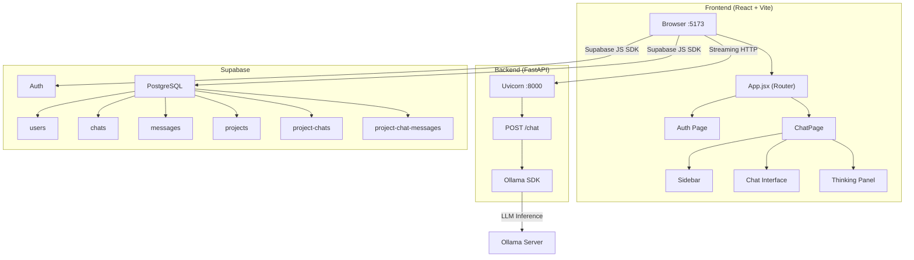
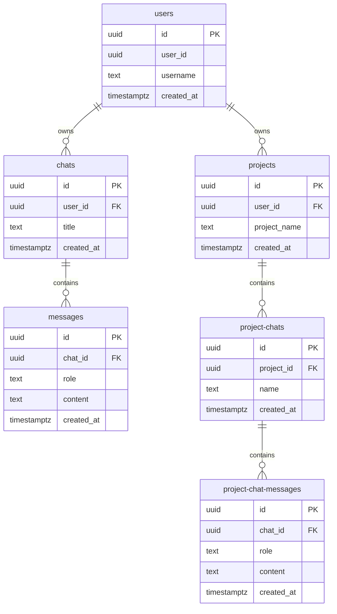

# Chat AI — Project Documentation

> A full-stack AI-powered chat application with project-based conversation management, real-time streaming responses, dark/light theme support, and Supabase-backed persistence.

---

## Table of Contents

1. [Project Overview](#project-overview)
2. [Tech Stack](#tech-stack)
3. [Architecture Overview](#architecture-overview)
4. [Frontend](#frontend)
5. [Backend](#backend)
6. [Database (Supabase)](#database-supabase)
7. [Environment Configuration](#environment-configuration)
8. [Installation & Setup](#installation--setup)
9. [Running the Application](#running-the-application)
10. [Deployment](#deployment)
11. [Project File Structure](#project-file-structure)

---

## Project Overview

**Chat AI** (branded as *Invixa AI*) is a conversational AI interface that allows users to:

- Chat with multiple AI models via [Ollama](https://ollama.ai)
- Organize conversations into **standalone chats** and **projects** (each project contains its own sub-chats)
- Stream AI responses in real-time with **thinking/reasoning** visibility
- Switch between response modes: **Default**, **Thinking**, **Deep Research**, and **Web Search**
- Share conversations via link, X (Twitter), or WhatsApp
- Toggle between **dark** and **light** themes
- Authenticate with email/password via Supabase Auth

---

## Tech Stack

### Frontend

| Technology | Version | Purpose |
|---|---|---|
| React | 19.x | UI framework |
| Vite | 8.x | Build tool & dev server |
| TailwindCSS | 4.x | Utility-first CSS styling |
| Framer Motion | 12.x | Animations & transitions |
| React Router DOM | 7.x | Client-side routing |
| React Markdown | 10.x | Markdown rendering in chat |
| React Syntax Highlighter | 16.x | Code block syntax highlighting |
| Remark GFM | 4.x | GitHub Flavored Markdown tables, lists |
| Lucide React | 1.x | Icon library |
| Supabase JS SDK | 2.x | Auth & database client |

### Backend

| Technology | Version | Purpose |
|---|---|---|
| Python | 3.x | Runtime |
| FastAPI | 0.128.0 | Web API framework |
| Uvicorn | 0.40.0 | ASGI server |
| Ollama Python SDK | 0.6.1 | AI model interaction |
| Pydantic | 2.12.5 | Request/response validation |
| python-dotenv | 1.2.1 | Environment variable loading |

### Database & Auth

| Service | Purpose |
|---|---|
| Supabase (PostgreSQL) | Database, authentication, and real-time capabilities |
| Supabase Auth | Email/password user authentication |

### AI Inference

| Service | Purpose |
|---|---|
| Ollama | Local/cloud LLM serving (DeepSeek V3.1, GPT-OSS 120B, GLM 5.1) |

---

## Architecture Overview



### Data Flow

1. **User authenticates** → Supabase Auth issues a session token
2. **User sends a message** → Frontend saves message to Supabase → sends request to FastAPI backend
3. **Backend processes** → Passes message + chat history + mode to Ollama → streams response tokens back
4. **Frontend receives stream** → Parses `<think>` blocks → updates UI in real-time → saves final AI response to Supabase

---

## Frontend

### Routing

| Route | Component | Description |
|---|---|---|
| `/` | `ChatPage` | Main application — sidebar + chat interface |
| `/auth` | `Auth` | Login / Sign-up page |

Unauthenticated users are automatically redirected to `/auth` via the `useChat` hook.

### Component Architecture

```
src/
├── App.jsx                    # Root router
├── main.jsx                   # React DOM entry point
├── supabaseClient.js          # Supabase client initialization
├── config/
│   └── models.js              # AI model definitions & feature mappings
├── hooks/
│   └── useChat.js             # Core business logic hook (state, CRUD, messaging)
└── Components/
    ├── Auth/
    │   └── Auth.jsx            # Login/Sign-up form with animations
    ├── Chat/
    │   ├── ChatPage.jsx        # Page layout — sidebar + chat + thinking panel
    │   ├── Chat.jsx            # Main chat area — model selector, messages, input
    │   ├── ChatInput.jsx       # Message input with mode toggles (thinking, research, web)
    │   ├── MessageBubble.jsx   # Individual message rendering (user/AI)
    │   ├── MarkdownRenderer.jsx# Markdown → React components (code, tables, lists)
    │   ├── CodeBlock.jsx       # Terminal-styled syntax-highlighted code blocks
    │   ├── TableBlock.jsx      # Styled data table wrapper
    │   ├── ThinkingModel.jsx   # Thinking/reasoning sidebar panel
    │   └── ShareModal.jsx      # Share conversation modal (link, X, WhatsApp)
    └── Sidebar/
        ├── Sidebar.jsx         # Full sidebar — search, projects, chats, profile
        └── SidebarItem.jsx     # Reusable sidebar list item with context menu
```

### Key Components Detail

#### `useChat.js` — Core Hook
The central state management hook that handles:
- **User session** — Fetches and validates the Supabase session
- **Chats CRUD** — Create, list, rename, delete standalone chats
- **Projects CRUD** — Create, list, rename, delete projects
- **Project Chats** — Nested chats within projects
- **Message handling** — Sends messages, streams AI responses, parses `<think>` blocks
- **State** — Manages `activeChatId`, `activeProjectId`, `activeProjectChatId`, `activeMessages`, thinking state

#### `ChatInput.jsx` — Input Modes
Users can toggle special response modes before sending:

| Mode | Model Used | System Prompt Behavior |
|---|---|---|
| Default | User-selected | "You are a helpful and concise AI assistant." |
| Thinking | `glm-5.1:cloud` | Step-by-step reasoning with `<think>` tags |
| Deep Research | `deepseek-v3.1:671b-cloud` | Comprehensive, verified research |
| Web Search | `deepseek-v3.1:671b-cloud` | Real-time web-focused info |

#### `CodeBlock.jsx` — Terminal UI
Renders code with:
- Language-aware terminal title bar with colored badges
- Line numbers via `react-syntax-highlighter`
- Copy-to-clipboard button
- Supports 30+ programming languages

#### `ThinkingModel.jsx` — Reasoning Panel
A slide-out panel that displays the AI's internal `<think>` block reasoning when the "Thinking" mode is active.

---

## Backend

### Entry Point — `main.py`

```python
from fastapi import FastAPI
from fastapi.middleware.cors import CORSMiddleware
from routes.ai import router as ai_router

app = FastAPI()

# CORS configured for local dev
origins = ["http://localhost:5173", "http://localhost:5174"]

app.add_middleware(
    CORSMiddleware,
    allow_origins=origins,
    allow_credentials=True,
    allow_methods=["*"],
    allow_headers=["*"],
)

app.include_router(ai_router)
```

### API Endpoints

#### `POST /chat`

The single API endpoint responsible for AI inference.

**Request Body:**

```json
{
  "message": "string (required) — the user's message",
  "model": "string (optional) — Ollama model ID, defaults to env OLLAMA_MODEL or 'llama3'",
  "mode": "string (optional) — one of: 'default', 'thinking', 'research', 'web'",
  "history": [
    {
      "role": "user | ai",
      "content": "string"
    }
  ]
}
```

**Response:** `text/plain` streaming response (Server-Sent Events style)

- Tokens are streamed as they arrive from Ollama
- Thinking content is wrapped in `<think>...</think>` tags
- Headers include `Cache-Control: no-cache` and `X-Accel-Buffering: no` for proper streaming

**Processing Pipeline:**

1. Resolves the AI model (request → env → fallback `llama3`)
2. Constructs a system prompt based on the `mode`
3. Appends chat history (converting `ai` role → `assistant` for Ollama compatibility)
4. Streams response via `ollama.chat()` in a background thread using `asyncio.Queue`
5. Parses `thinking` vs `content` from each chunk and yields appropriately

---

## Database (Supabase)

The app uses **Supabase** (hosted PostgreSQL) with **6 tables**. All tables leverage Supabase's auto-generated `id` (UUID) and `created_at` (timestamp) columns.

### Table Schema

#### 1. `users`

Stores user profile data linked to Supabase Auth.

| Column | Type | Description |
|---|---|---|
| `id` | UUID (PK) | Auto-generated primary key |
| `user_id` | UUID | References Supabase Auth user ID |
| `username` | TEXT | User-chosen display name |
| `created_at` | TIMESTAMPTZ | Auto-generated timestamp |

#### 2. `chats`

Standalone (non-project) chat conversations.

| Column | Type | Description |
|---|---|---|
| `id` | UUID (PK) | Auto-generated primary key |
| `user_id` | UUID | Owner — references Supabase Auth user ID |
| `title` | TEXT | Chat title (editable, defaults to "New Chat") |
| `created_at` | TIMESTAMPTZ | Auto-generated timestamp |

#### 3. `messages`

Messages belonging to standalone chats.

| Column | Type | Description |
|---|---|---|
| `id` | UUID (PK) | Auto-generated primary key |
| `chat_id` | UUID (FK) | References `chats.id` |
| `role` | TEXT | `"user"` or `"ai"` |
| `content` | TEXT | Message text content |
| `created_at` | TIMESTAMPTZ | Auto-generated timestamp |

#### 4. `projects`

Project containers that group related chats.

| Column | Type | Description |
|---|---|---|
| `id` | UUID (PK) | Auto-generated primary key |
| `user_id` | UUID | Owner — references Supabase Auth user ID |
| `project_name` | TEXT | Project title (editable, defaults to "New Project") |
| `created_at` | TIMESTAMPTZ | Auto-generated timestamp |

#### 5. `project-chats`

Chat sessions nested under a project.

| Column | Type | Description |
|---|---|---|
| `id` | UUID (PK) | Auto-generated primary key |
| `project_id` | UUID (FK) | References `projects.id` |
| `name` | TEXT | Chat session name (editable, defaults to "New Chat") |
| `created_at` | TIMESTAMPTZ | Auto-generated timestamp |

#### 6. `project-chat-messages`

Messages belonging to project-level chats.

| Column | Type | Description |
|---|---|---|
| `id` | UUID (PK) | Auto-generated primary key |
| `chat_id` | UUID (FK) | References `project-chats.id` |
| `role` | TEXT | `"user"` or `"ai"` |
| `content` | TEXT | Message text content |
| `created_at` | TIMESTAMPTZ | Auto-generated timestamp |

### Entity Relationship Diagram



---

## Environment Configuration

### Frontend — `.env.local`

```env
VITE_SUPABSE_URL=https://your-project.supabase.co
VITE_SUPABASE_ANON_KEY=your-supabase-anon-key
```

> [!NOTE]
> The env variable uses `VITE_SUPABSE_URL` (note the typo — kept for backward compatibility).

### Backend — `backend/.env`

```env
OLLAMA_MODEL=deepseek-v3.1:671b-cloud
```

This sets the default AI model. Can be overridden per-request via the `model` field in the API body.

---

## Installation & Setup

### Prerequisites

| Requirement | Minimum Version |
|---|---|
| Node.js | 18+ |
| npm | 9+ |
| Python | 3.10+ |
| pip | 22+ |
| Ollama | Latest |
| Supabase Account | Free tier works |

### Step 1: Clone the Repository

```bash
git clone <repository-url>
cd chat-ai
```

### Step 2: Frontend Setup

```bash
# Install Node dependencies
npm install
```

### Step 3: Backend Setup

```bash
# Navigate to backend
cd backend

# Create a Python virtual environment
python -m venv venv

# Activate virtual environment
# Windows:
.\venv\Scripts\activate
# macOS/Linux:
source venv/bin/activate

# Install Python dependencies
pip install fastapi uvicorn ollama python-dotenv pydantic
```

### Step 4: Supabase Setup

1. Create a project at [supabase.com](https://supabase.com)
2. Create the following tables in the **Table Editor** (or via SQL):

```sql
-- Users table
CREATE TABLE users (
    id UUID DEFAULT gen_random_uuid() PRIMARY KEY,
    user_id UUID NOT NULL,
    username TEXT NOT NULL,
    created_at TIMESTAMPTZ DEFAULT now()
);

-- Standalone chats
CREATE TABLE chats (
    id UUID DEFAULT gen_random_uuid() PRIMARY KEY,
    user_id UUID NOT NULL,
    title TEXT DEFAULT 'New Chat',
    created_at TIMESTAMPTZ DEFAULT now()
);

-- Messages for standalone chats
CREATE TABLE messages (
    id UUID DEFAULT gen_random_uuid() PRIMARY KEY,
    chat_id UUID NOT NULL REFERENCES chats(id) ON DELETE CASCADE,
    role TEXT NOT NULL,
    content TEXT NOT NULL,
    created_at TIMESTAMPTZ DEFAULT now()
);

-- Projects
CREATE TABLE projects (
    id UUID DEFAULT gen_random_uuid() PRIMARY KEY,
    user_id UUID NOT NULL,
    project_name TEXT DEFAULT 'New Project',
    created_at TIMESTAMPTZ DEFAULT now()
);

-- Project chats (note: table name uses hyphen)
CREATE TABLE "project-chats" (
    id UUID DEFAULT gen_random_uuid() PRIMARY KEY,
    project_id UUID NOT NULL REFERENCES projects(id) ON DELETE CASCADE,
    name TEXT DEFAULT 'New Chat',
    created_at TIMESTAMPTZ DEFAULT now()
);

-- Project chat messages (note: table name uses hyphen)
CREATE TABLE "project-chat-messages" (
    id UUID DEFAULT gen_random_uuid() PRIMARY KEY,
    chat_id UUID NOT NULL REFERENCES "project-chats"(id) ON DELETE CASCADE,
    role TEXT NOT NULL,
    content TEXT NOT NULL,
    created_at TIMESTAMPTZ DEFAULT now()
);
```

3. Enable **Row Level Security (RLS)** on all tables as needed
4. Copy your **Project URL** and **Anon Key** from Supabase → Settings → API

### Step 5: Environment Variables

**Frontend** — create `.env.local` in the project root:

```env
VITE_SUPABSE_URL=https://your-project-id.supabase.co
VITE_SUPABASE_ANON_KEY=eyJhbGci...your-anon-key
```

**Backend** — create `.env` in `backend/`:

```env
OLLAMA_MODEL=deepseek-v3.1:671b-cloud
```

### Step 6: Ollama Setup

```bash
# Install Ollama (follow https://ollama.ai)
# Pull your desired model
ollama pull deepseek-v3.1:671b-cloud

# Start the Ollama server
ollama serve
```

---

## Running the Application

You need **three terminal windows** running simultaneously:

### Terminal 1 — Ollama Server

```bash
ollama serve
```

> Ollama runs at `http://localhost:11434` by default.

### Terminal 2 — Backend (FastAPI)

```bash
cd backend
# Activate venv if not already active
.\venv\Scripts\activate       # Windows
# source venv/bin/activate    # macOS/Linux

uvicorn main:app --reload
```

> Backend runs at `http://localhost:8000`

### Terminal 3 — Frontend (Vite)

```bash
# From project root
npm run dev
```

> Frontend runs at `http://localhost:5173`

### Access the App

Open your browser and navigate to **`http://localhost:5173`**

1. You'll be redirected to `/auth` — create an account or sign in
2. After authentication, the main chat interface loads
3. Create chats or projects from the sidebar
4. Select a model and response mode, then start chatting!

---

## Deployment

The application has been deployed to production:

| Layer | Platform | URL |
|---|---|---|
| Frontend | Vercel | `invixa-ai-qjia.vercel.app` |
| Backend | Render | `invixa-ai.onrender.com` |
| Database | Supabase | Cloud-hosted PostgreSQL |

> [!IMPORTANT]
> For production deployment, update the CORS `origins` in `backend/main.py` to include your production frontend URL. Also update the API endpoint URL in `useChat.js` (`http://localhost:8000/chat` → your production backend URL).

---

## Project File Structure

```
chat-ai/
├── index.html                      # HTML entry point
├── package.json                    # Node.js dependencies & scripts
├── vite.config.js                  # Vite configuration (React + TailwindCSS plugins)
├── eslint.config.js                # ESLint configuration
├── .env.local                      # Frontend environment variables (gitignored)
├── .gitignore                      # Git ignore rules
│
├── public/
│   ├── favicon.svg                 # App favicon
│   └── icons.svg                   # Shared SVG icons
│
├── src/
│   ├── main.jsx                    # React DOM mount point
│   ├── App.jsx                     # Root component with Router
│   ├── App.css                     # Global styles (currently empty)
│   ├── index.css                   # Base Tailwind imports
│   ├── supabaseClient.js           # Supabase client initialization
│   │
│   ├── config/
│   │   └── models.js               # AI model definitions & feature mappings
│   │
│   ├── hooks/
│   │   └── useChat.js              # Central state management & business logic
│   │
│   └── Components/
│       ├── Auth/
│       │   └── Auth.jsx            # Authentication page (login/signup)
│       │
│       ├── Chat/
│       │   ├── ChatPage.jsx        # Main page layout orchestrator
│       │   ├── Chat.jsx            # Chat area with model selector
│       │   ├── ChatInput.jsx       # Message input bar with mode toggles
│       │   ├── MessageBubble.jsx   # Individual message display
│       │   ├── MarkdownRenderer.jsx# Markdown-to-React component mapper
│       │   ├── CodeBlock.jsx       # Terminal-styled code blocks
│       │   ├── TableBlock.jsx      # Styled data table wrapper
│       │   ├── ThinkingModel.jsx   # AI reasoning panel
│       │   └── ShareModal.jsx      # Share conversation modal
│       │
│       └── Sidebar/
│           ├── Sidebar.jsx         # Sidebar with search, projects, chats, profile
│           └── SidebarItem.jsx     # Reusable sidebar item with context menu
│
└── backend/
    ├── .env                        # Backend environment variables
    ├── main.py                     # FastAPI app entry point
    └── routes/
        └── ai.py                   # AI chat endpoint with streaming
```

---

> [!TIP]
> **Available npm scripts:**
> - `npm run dev` — Start the Vite dev server
> - `npm run build` — Build for production
> - `npm run preview` — Preview the production build
> - `npm run lint` — Run ESLint
